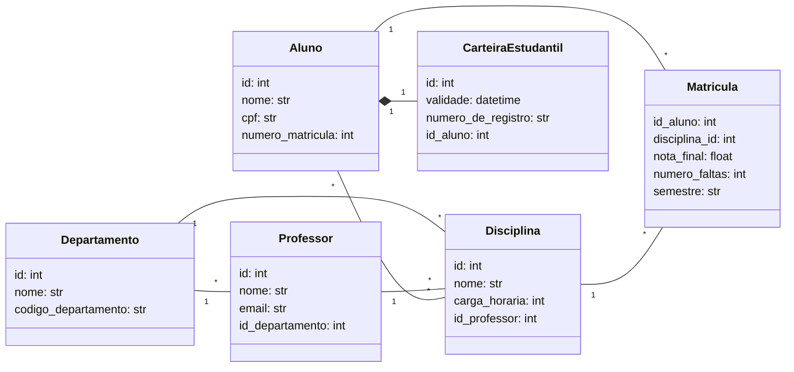

# Sistema de Gestão Acadêmica 
## Diagrama de Classes UML

```mermaid
classDiagram
    direction LR

    class Departamento {
        id: int
        nome: str
        codigo_departamento: str
    }

    class Professor {
        id: int
        nome: str
        email: str
        id_departamento: int
    }

    class Disciplina {
        id: int
        nome: str
        carga_horaria: int
        id_professor: int
    }

    class Aluno {
        id: int
        nome: str
        cpf: str
        numero_matricula: int
    }

    class CarteiraEstudantil {
        id: int
        validade: datetime
        numero_de_registro: str
        id_aluno: int
    }

    class Matricula {
        id_aluno: int
        disciplina_id: int
        nota_final: float
        numero_faltas: int
        semestre: str
    }

    %% Relacionamentos One-to-Many
    Departamento "1" -- "*" Professor 
    Departamento "1" -- "*" Disciplina 
    Professor "1" -- "*" Disciplina 
    
    %% Relacionamento One-to-One 
    Aluno "1" *-- "1" CarteiraEstudantil 
    
    %% Relacionamento Many-to-One
    Aluno "1" -- "*" Matricula 
    Disciplina "1" -- "*" Matricula

    %% Relacionamento Many-to-Many 
    Aluno "*" -- "*" Disciplina 
```